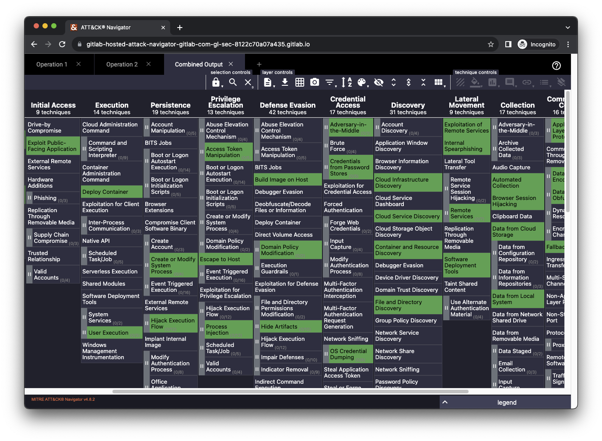

# GitLab Hosted ATT&CK Navigator

This project shows how you can use GitLab.com to build and deploy your own instance of MITRE's [ATT&CK Navigator](https://github.com/mitre-attack/attack-navigator).

We've included automation to parse user-provided YAML files, which will then pre-populate the application with annotated matrixes (singular and combined). The build is automatically hosted using GitLab Pages with optional authentication, giving you a full solution to visualize your coverage of the [MITRE ATT&CK framework](https://attack.mitre.org/).

You can see this example build [here](https://gitlab-hosted-attack-navigator-gitlab-com-gl-sec-8122c70a07a435.gitlab.io/), and read [this blog](https://about.gitlab.com/blog/2023/08/09/gitlab-mitre-attack-navigator/) for a detailed explanation of the project and how we use it ourselves.

## Who might use this project

MITRE ATT&CK is a framework to classify and describe cybersecurity attacks based on real-world observations. It provides a common language that can be used by different groups inside a security organization to collaborate on security initiatives.

This project can automatically build a pre-configured version of ATT&CK Navigator for you. This is a static web application that can help you visualize the tactics and techniques inside the ATT&CK framework. It is essentially a reporting tool that supports custom annotations.

At GitLab, our [Red Team](https://about.gitlab.com/handbook/security/threat-management/red-team/) uses this tool to keep track of which techniques we have previously emulated. However, anyone who is already leveraging the ATT&CK framework may find this project useful.

## How to use this project

The high-level steps to use this yourself are:

1. Fork this project to your own namespace.
2. Optionally, make your fork private.
3. Provide your own YAML files inside the `layers/` folder. Use the `templates/template.yaml` file as guidance.
4. Run the default pipeline if you didn't already kick it off by changing content in the `layers/` folder.
4. Once the pipeline has completed, go to "Deploy" -> "Pages", and check the box "Use unique domain".

That's it! You can now visit your site at the URL specified in "Deploy" -> "Pages". If you made the project private, it will require you to authenticate with your GitLab credentials.

Going forward, any changes you make to the `layers/` folder will automatically build a new version of the application including your new layer files.